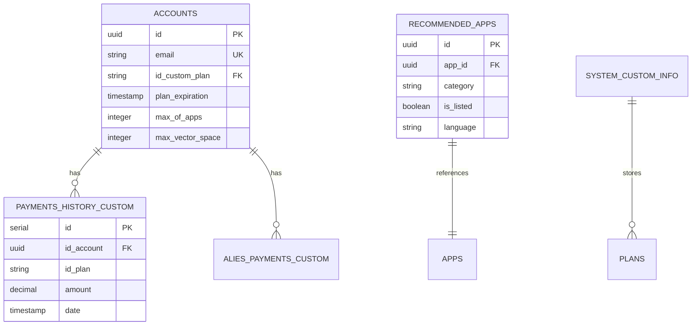

# Tài liệu Kỹ thuật Dashboard Module - Dify

## 📋 Mục lục

1. [Tổng quan Kiến trúc](#1-tổng-quan-kiến-trúc)
2. [Hướng dẫn Cài đặt và Triển khai](#2-hướng-dẫn-cài-đặt-và-triển-khai)
3. [API Documentation](#3-api-documentation)
4. [Frontend Components Documentation](#4-frontend-components-documentation)
5. [Database Schema](#5-database-schema)
6. [Development Guide](#6-development-guide)
7. [Configuration Reference](#7-configuration-reference)

---

## 1. Tổng quan Kiến trúc

### 1.1 Kiến trúc Tổng thể

Dashboard Module trong Dify được thiết kế theo kiến trúc **microservice** với 2 thành phần chính:

- **Frontend**: Streamlit application (port 8501)
- **Backend**: Flask REST API (port 5001/dashboard)

```
┌─────────────────────┐    HTTP/REST API    ┌─────────────────────┐
│   Streamlit App     │ ◄─────────────────► │   Flask API         │
│   (Dashboard UI)    │   with API Token    │   (/dashboard/*)    │
│   Port: 8501        │                     │   Port: 5001        │
└─────────────────────┘                     └─────────────────────┘
           │                                           │
           │                                           │
           ▼                                           ▼
┌─────────────────────┐                     ┌─────────────────────┐
│   config.yaml       │                     │   PostgreSQL DB     │
│   Authentication    │                     │   Models & Data     │
└─────────────────────┘                     └─────────────────────┘
```

### 1.2 Luồng Dữ liệu (Data Flow)

```
User Login (Streamlit Auth)
    ↓
Dashboard Navigation
    ↓
Component Selection (Accounts/Plans/Payments/Explore)
    ↓
HTTP Request với API Token
    ↓
Flask API Endpoint (/dashboard/*)
    ↓
API Key Validation
    ↓
Database Query/Update
    ↓
JSON Response
    ↓
Streamlit UI Update
```

### 1.3 Deployment Architecture

```yaml
# Docker Compose Structure
services:
  api:
    image: dify/api
    ports: ["5001:5001"]
    
  dashboard:
    image: hota/dify/dashboard
    ports: ["8501:8501"]
    environment:
      API_URL: "http://api:5001"
    depends_on: [api]
    
  db:
    image: postgres:15-alpine
    volumes: ["./volumes/db:/var/lib/postgresql/data"]
```

---

## 2. Hướng dẫn Cài đặt và Triển khai

### 2.1 Cài đặt Local Development

#### Bước 1: Clone và Setup Backend
```bash
# Clone repository
git clone <dify-repo>
cd dify

# Setup API backend
cd api
pip install -r requirements.txt

# Setup database
flask upgrade-db

# Start API server
python app.py
```

#### Bước 2: Setup Dashboard Frontend
```bash
# Navigate to dashboard directory
cd ../dashboard

# Install dependencies
pip install -r requirements.txt

# Configure API URL
export API_URL="http://localhost:5001"

# Start Streamlit app
streamlit run main.py --server.port=8501 --server.address=0.0.0.0
```

### 2.2 Docker Deployment

#### Bước 1: Build Dashboard Image
```bash
cd dashboard
docker build -t hota/dify/dashboard .
```

#### Bước 2: Run với Docker Compose
```bash
cd ../docker
docker-compose up -d dashboard
```

### 2.3 Environment Variables

| Variable | Description | Default | Required |
|----------|-------------|---------|----------|
| `API_URL` | URL của Dify API backend | `http://localhost:5001` | Yes |
| `STREAMLIT_SERVER_PORT` | Port cho Streamlit | `8501` | No |
| `STREAMLIT_SERVER_ADDRESS` | Bind address | `0.0.0.0` | No |

### 2.4 Troubleshooting

#### Lỗi thường gặp:

**1. Connection refused to API**
```bash
# Kiểm tra API service
curl http://localhost:5001/health

# Kiểm tra network trong Docker
docker network ls
docker network inspect dify_default
```

**2. Authentication failed**
```bash
# Kiểm tra API token trong config.yaml
cat dashboard/config.yaml | grep token

# Kiểm tra API key trong backend
grep "API_KEY" api/controllers/dashboard/__init__.py
```

**3. Database connection issues**
```bash
# Kiểm tra database status
docker-compose ps db

# Check database logs
docker-compose logs db
```

---

## 3. API Documentation

### 3.1 Authentication

Tất cả API endpoints yêu cầu **API Token** trong header:

```http
GET /dashboard/accounts
Headers:
  api-token: 89fisiqoo009
  Content-Type: application/json
```

### 3.2 Base URL

```
Production: https://your-domain.com/dashboard
Development: http://localhost:5001/dashboard
```

### 3.3 Endpoints Overview

| Endpoint | Method | Description |
|----------|--------|-------------|
| `/` | GET | Welcome message |
| `/accounts` | GET, PUT, DELETE | Account management |
| `/plans` | GET, PUT | Plan management |
| `/explore` | GET, POST | Recommended apps |
| `/payment_settings` | GET, PUT | Payment configuration |
| `/payment_history` | GET | Payment history |
| `/webhook/plan` | POST | Payment webhook |

### 3.4 Detailed API Specifications

#### 3.4.1 Accounts API

**GET /dashboard/accounts**
```http
GET /dashboard/accounts
Headers:
  api-token: 89fisiqoo009

Response 200:
[
  {
    "id": "uuid-string",
    "name": "John Doe",
    "email": "john@example.com",
    "status": "active",
    "id_custom_plan": "premium",
    "plan_expiration": "2024-12-31T23:59:59Z",
    "month_before_banned": 3,
    "max_of_apps": 10,
    "max_vector_space": 1000,
    "max_annotation_quota_limit": 500,
    "max_documents_upload_quota": 100,
    "last_login_at": "2024-01-15T10:30:00Z",
    "last_login_ip": "192.168.1.1",
    "last_active_at": "2024-01-15T11:00:00Z",
    "created_at": "2024-01-01T00:00:00Z",
    "updated_at": "2024-01-15T11:00:00Z"
  }
]
```

**PUT /dashboard/accounts**
```http
PUT /dashboard/accounts
Headers:
  api-token: 89fisiqoo009
  Content-Type: application/json

Body:
[
  {
    "id": "uuid-string",
    "status": "active",
    "id_custom_plan": "premium",
    "plan_expiration": "2024-12-31T23:59:59Z",
    "month_before_banned": 3,
    "max_of_apps": 10,
    "max_vector_space": 1000,
    "max_annotation_quota_limit": 500,
    "max_documents_upload_quota": 100
  }
]

Response 200:
{
  "status": "success",
  "message": "Accounts updated successfully"
}
```

#### 3.4.2 Plans API

**GET /dashboard/plans**
```http
GET /dashboard/plans
Headers:
  api-token: 89fisiqoo009

Response 200:
[
  {
    "id": "basic",
    "name": "Basic Plan",
    "description": "Starter plan for individuals",
    "price": 9.99,
    "plan_expiration": 30,
    "features": {
      "members": 1,
      "apps": 5,
      "vector_space": 100,
      "knowledge_rate_limit": 10,
      "annotation_quota_limit": 50,
      "documents_upload_quota": 20
    }
  }
]
```

#### 3.4.3 Explore API

**GET /dashboard/explore**
```http
GET /dashboard/explore
Headers:
  api-token: 89fisiqoo009

Response 200:
[
  {
    "id": "uuid-string",
    "app_id": "app-uuid",
    "description": "AI Writing Assistant",
    "copyright": "© 2024 Company",
    "privacy_policy": "https://example.com/privacy",
    "category": "Writing",
    "position": 1,
    "is_listed": true,
    "language": "en-US",
    "created_at": "2024-01-01T00:00:00Z",
    "updated_at": "2024-01-15T11:00:00Z"
  }
]
```

**POST /dashboard/explore**
```http
POST /dashboard/explore
Headers:
  api-token: 89fisiqoo009
  Content-Type: application/json

Body:
{
  "app_id": "app-uuid",
  "description": "New AI Tool",
  "category": "Assistant",
  "position": 5,
  "is_listed": true,
  "language": "en-US"
}

Response 201:
{
  "status": "success",
  "message": "Recommended app added successfully",
  "id": "new-uuid"
}
```

#### 3.4.4 Payment Settings API

**GET /dashboard/payment_settings**
```http
GET /dashboard/payment_settings
Headers:
  api-token: 89fisiqoo009

Response 200:
{
  "access_token": "encrypted-token",
  "account_name": "Business Account",
  "account_id": "123456789",
  "bank_id": "VCB"
}
```

**PUT /dashboard/payment_settings**
```http
PUT /dashboard/payment_settings
Headers:
  api-token: 89fisiqoo009
  Content-Type: application/json

Body:
{
  "access_token": "new-encrypted-token",
  "account_name": "Updated Account",
  "account_id": "987654321",
  "bank_id": "TCB"
}

Response 200:
{
  "status": "success",
  "message": "Payment settings updated successfully"
}
```

#### 3.4.5 Payment History API

**GET /dashboard/payment_history**
```http
GET /dashboard/payment_history
Headers:
  api-token: 89fisiqoo009

Response 200:
[
  {
    "id": 1,
    "id_account": "user-uuid",
    "id_plan": "premium",
    "type": "subscription",
    "transactionID": "TXN123456789",
    "amount": 29.99,
    "description": "Premium Plan - Monthly",
    "date": "2024-01-15T10:30:00Z",
    "bank": "VCB"
  }
]
```

#### 3.4.6 Webhook API

**POST /dashboard/webhook/plan**
```http
POST /dashboard/webhook/plan
Headers:
  Content-Type: application/json

Body:
{
  "transaction_id": "TXN123456789",
  "amount": 29.99,
  "status": "success",
  "account_id": "user-uuid",
  "plan_id": "premium",
  "timestamp": "2024-01-15T10:30:00Z"
}

Response 200:
{
  "status": true,
  "msg": "OK"
}
```

#### 3.4.7 Error Responses

```http
Response 401:
{
  "message": "Unauthorized: Invalid or missing API Key"
}

Response 404:
{
  "status": "error",
  "message": "Account not found."
}

Response 422:
{
  "status": "error",
  "message": "Validation error",
  "errors": {
    "email": ["Invalid email format"],
    "max_of_apps": ["Must be between 1 and 1000"]
  }
}

Response 500:
{
  "status": "error",
  "message": "Internal server error"
}
```

#### 3.4.8 Rate Limiting

Tất cả API endpoints có rate limiting:
- **Limit**: 100 requests per minute per IP
- **Headers**: `X-RateLimit-Remaining`, `X-RateLimit-Reset`

```http
Response 429:
{
  "message": "Rate limit exceeded. Try again in 60 seconds."
}
```

---

## 4. Frontend Components Documentation

### 4.1 Main Application (main.py)

**Chức năng chính:**
- Streamlit authentication setup
- Navigation menu với 4 modules
- Session state management

**Code structure:**
```python
# Authentication setup
authenticator = stauth.Authenticate(config['credentials'], ...)

# Navigation logic
if st.session_state['authentication_status']:
    menu = st.sidebar.radio("Go to", ["Accounts", "Plans", "Payments", "Explore"])
    
    if menu == "Accounts":
        render_accounts()
    # ... other components
```

### 4.2 Accounts Component

**File:** `components/accounts.py`

**Chức năng:**
- Hiển thị danh sách tất cả user accounts
- Chỉnh sửa account settings (status, plan, quotas)
- Bulk update accounts

**UI Workflow:**
1. Load accounts từ API
2. Hiển thị trong DataFrame với st.data_editor
3. User chỉnh sửa trực tiếp trong table
4. Save changes gửi PUT request

### 4.3 Plans Component

**File:** `components/plans.py`

**Chức năng:**
- Quản lý pricing plans
- Cấu hình features cho từng plan
- CRUD operations cho plans

**Key features:**
- Dynamic plan creation với UUID
- Feature configuration (apps, vector space, quotas)
- Real-time plan updates

### 4.4 Payments Component

**File:** `components/payments.py`

**Chức năng:**
- Cấu hình payment gateway settings
- Hiển thị payment history
- Webhook URL management

**Bank Integration:**
- Support 80+ Vietnamese banks
- Bank selection với dropdown
- Secure token storage

### 4.5 Explore Component

**File:** `components/explore.py`

**Chức năng:**
- Quản lý recommended apps
- Add/edit/delete recommended apps
- App categorization

---

## 5. Database Schema

### 5.1 Account Model

```sql
CREATE TABLE accounts (
    id UUID PRIMARY KEY DEFAULT uuid_generate_v4(),
    name VARCHAR(255) NOT NULL,
    email VARCHAR(255) NOT NULL,
    password VARCHAR(255),
    password_salt VARCHAR(255),
    avatar VARCHAR(255),
    interface_language VARCHAR(255),
    interface_theme VARCHAR(255),
    timezone VARCHAR(255),
    last_login_at TIMESTAMP,
    last_login_ip VARCHAR(255),
    last_active_at TIMESTAMP NOT NULL DEFAULT CURRENT_TIMESTAMP,
    status VARCHAR(16) NOT NULL DEFAULT 'active',
    
    -- Custom fields for dashboard
    month_before_banned INTEGER NOT NULL DEFAULT 3,
    id_custom_plan VARCHAR(255),
    plan_expiration TIMESTAMP NOT NULL DEFAULT CURRENT_TIMESTAMP,
    max_of_apps INTEGER NOT NULL DEFAULT 10,
    max_vector_space INTEGER NOT NULL DEFAULT 200,
    max_annotation_quota_limit INTEGER NOT NULL DEFAULT 10,
    max_documents_upload_quota INTEGER NOT NULL DEFAULT 50,
    
    created_at TIMESTAMP NOT NULL DEFAULT CURRENT_TIMESTAMP,
    updated_at TIMESTAMP NOT NULL DEFAULT CURRENT_TIMESTAMP
);

-- Indexes
CREATE INDEX account_email_idx ON accounts(email);
CREATE INDEX id_custom_plan_idx ON accounts(id_custom_plan);
```

### 5.2 RecommendedApp Model

```sql
CREATE TABLE recommended_apps (
    id UUID PRIMARY KEY DEFAULT uuid_generate_v4(),
    app_id UUID NOT NULL,
    description TEXT,
    copyright VARCHAR(255),
    privacy_policy VARCHAR(255),
    category VARCHAR(255) NOT NULL,
    position INTEGER NOT NULL DEFAULT 0,
    is_listed BOOLEAN NOT NULL DEFAULT true,
    language VARCHAR(255) NOT NULL DEFAULT 'en-US',
    
    created_at TIMESTAMP NOT NULL DEFAULT CURRENT_TIMESTAMP,
    updated_at TIMESTAMP NOT NULL DEFAULT CURRENT_TIMESTAMP
);

-- Indexes
CREATE INDEX recommended_app_app_id_idx ON recommended_apps(app_id);
CREATE INDEX recommended_app_is_listed_idx ON recommended_apps(is_listed, language);
```

### 5.3 Custom Payment Models

```sql
-- Payment settings storage
CREATE TABLE system_custom_info (
    id SERIAL PRIMARY KEY,
    name VARCHAR(255) UNIQUE NOT NULL,
    value JSONB,
    created_at TIMESTAMP DEFAULT CURRENT_TIMESTAMP,
    updated_at TIMESTAMP DEFAULT CURRENT_TIMESTAMP
);

-- Payment history
CREATE TABLE payments_history_custom (
    id SERIAL PRIMARY KEY,
    id_account UUID NOT NULL,
    id_plan VARCHAR(255),
    type VARCHAR(50),
    transaction_id VARCHAR(255),
    amount DECIMAL(10,2),
    description TEXT,
    date TIMESTAMP DEFAULT CURRENT_TIMESTAMP,
    bank VARCHAR(255)
);

-- Payment aliases for processing
CREATE TABLE alies_payments_custom (
    id SERIAL PRIMARY KEY,
    id_account UUID NOT NULL,
    id_plan VARCHAR(255),
    alias_code VARCHAR(255) UNIQUE,
    created_at TIMESTAMP DEFAULT CURRENT_TIMESTAMP
);
```

### 5.4 Database Relationships



### 5.5 Migration Scripts

#### Tạo Migration mới
```bash
cd api
flask db migrate -m "Add dashboard custom fields"
flask db upgrade
```

#### Example Migration Script
```python
"""Add dashboard custom fields to accounts

Revision ID: abc123def456
Revises: previous_revision
Create Date: 2024-01-15 10:30:00.000000

"""
from alembic import op
import sqlalchemy as sa

# revision identifiers
revision = 'abc123def456'
down_revision = 'previous_revision'
branch_labels = None
depends_on = None

def upgrade():
    # Add custom fields to accounts table
    op.add_column('accounts', sa.Column('month_before_banned', sa.Integer(), nullable=False, server_default='3'))
    op.add_column('accounts', sa.Column('id_custom_plan', sa.String(255), nullable=True))
    op.add_column('accounts', sa.Column('plan_expiration', sa.DateTime(), nullable=False, server_default=sa.text('CURRENT_TIMESTAMP')))
    op.add_column('accounts', sa.Column('max_of_apps', sa.Integer(), nullable=False, server_default='10'))
    op.add_column('accounts', sa.Column('max_vector_space', sa.Integer(), nullable=False, server_default='200'))
    op.add_column('accounts', sa.Column('max_annotation_quota_limit', sa.Integer(), nullable=False, server_default='10'))
    op.add_column('accounts', sa.Column('max_documents_upload_quota', sa.Integer(), nullable=False, server_default='50'))

    # Create index for custom plan
    op.create_index('id_custom_plan_idx', 'accounts', ['id_custom_plan'])

def downgrade():
    # Remove custom fields
    op.drop_index('id_custom_plan_idx', table_name='accounts')
    op.drop_column('accounts', 'max_documents_upload_quota')
    op.drop_column('accounts', 'max_annotation_quota_limit')
    op.drop_column('accounts', 'max_vector_space')
    op.drop_column('accounts', 'max_of_apps')
    op.drop_column('accounts', 'plan_expiration')
    op.drop_column('accounts', 'id_custom_plan')
    op.drop_column('accounts', 'month_before_banned')
```

### 5.6 Data Seeding

#### Seed Default Plans
```python
# scripts/seed_plans.py
from api.models import db
from api.models.system_custom_info import SystemCustomInfo

def seed_default_plans():
    default_plans = [
        {
            "id": "free",
            "name": "Free Plan",
            "description": "Basic features for getting started",
            "price": 0.0,
            "plan_expiration": 365,
            "features": {
                "members": 1,
                "apps": 3,
                "vector_space": 50,
                "knowledge_rate_limit": 5,
                "annotation_quota_limit": 10,
                "documents_upload_quota": 10
            }
        },
        {
            "id": "premium",
            "name": "Premium Plan",
            "description": "Advanced features for professionals",
            "price": 29.99,
            "plan_expiration": 30,
            "features": {
                "members": 5,
                "apps": 20,
                "vector_space": 500,
                "knowledge_rate_limit": 50,
                "annotation_quota_limit": 100,
                "documents_upload_quota": 100
            }
        }
    ]

    # Store plans in system_custom_info table
    plan_config = SystemCustomInfo.query.filter_by(name='plan').first()
    if not plan_config:
        plan_config = SystemCustomInfo(name='plan', value=default_plans)
        db.session.add(plan_config)
    else:
        plan_config.value = default_plans

    db.session.commit()
    print("Default plans seeded successfully!")

if __name__ == "__main__":
    seed_default_plans()
```

---

## 6. Development Guide

### 6.1 Thêm Component Mới

#### Bước 1: Tạo Component File
```python
# dashboard/components/new_component.py
import streamlit as st
from modules.request import requestAuth

def render():
    st.subheader("New Component")
    
    # Your component logic here
    data = load_data()
    display_data(data)

def load_data():
    res = requestAuth.get("new_endpoint")
    if res.status_code == 200:
        return res.json()
    else:
        st.error(f"Error loading data: {res.status_code}")
        return []
```

#### Bước 2: Thêm vào Main Navigation
```python
# dashboard/main.py
from components.new_component import render as render_new_component

# Add to menu options
menu = st.sidebar.radio("Go to", ["Accounts", "Plans", "Payments", "Explore", "New Component"])

# Add routing
elif menu == "New Component":
    render_new_component()
```

#### Bước 3: Tạo Backend API
```python
# api/controllers/dashboard/new_endpoint.py
from flask_restful import Resource
from controllers.dashboard import api, api_key_required

class NewEndpointApi(Resource):
    method_decorators = [api_key_required]
    
    def get(self):
        # Your API logic
        return {"data": "example"}

api.add_resource(NewEndpointApi, "/new_endpoint")
```

#### Bước 4: Register trong Dashboard Init
```python
# api/controllers/dashboard/__init__.py
from . import accounts, explore, index, plan, new_endpoint
```

### 6.2 Code Structure Best Practices

```
dashboard/
├── main.py                 # Entry point, navigation
├── config.py              # Configuration loader
├── components/            # UI components
│   ├── __init__.py
│   ├── accounts.py        # Account management
│   ├── plans.py           # Plan management
│   └── base.py            # Shared utilities
├── modules/               # Shared modules
│   ├── __init__.py
│   ├── request.py         # HTTP client
│   └── utils.py           # Helper functions
└── tests/                 # Test files
    ├── test_components.py
    └── test_api.py
```

### 6.3 Testing Guidelines

#### Unit Tests cho Components
```python
# tests/test_components.py
import pytest
import streamlit as st
from unittest.mock import patch, MagicMock

def test_accounts_component():
    with patch('modules.request.requestAuth.get') as mock_get:
        mock_get.return_value.status_code = 200
        mock_get.return_value.json.return_value = [
            {"id": "test", "name": "Test User", "email": "test@example.com"}
        ]
        
        from components.accounts import render
        render()
        
        # Assert expected behavior
        mock_get.assert_called_once_with("accounts")
```

#### API Tests
```python
# tests/test_api.py
import pytest
from api.app import create_app

@pytest.fixture
def client():
    app = create_app()
    app.config['TESTING'] = True
    with app.test_client() as client:
        yield client

def test_accounts_api(client):
    headers = {'api-token': '89fisiqoo009'}
    response = client.get('/dashboard/accounts', headers=headers)
    
    assert response.status_code == 200
    assert isinstance(response.json, list)
```

### 6.4 Security Considerations

#### API Security
```python
# Strong API key validation
API_KEY = os.environ.get('DASHBOARD_API_KEY', '89fisiqoo009')

def api_key_required(f):
    @wraps(f)
    def decorated_function(*args, **kwargs):
        api_key = request.headers.get('api-token')
        if not api_key or not secrets.compare_digest(api_key, API_KEY):
            return {'message': 'Unauthorized'}, 401
        return f(*args, **kwargs)
    return decorated_function
```

#### Input Validation
```python
from pydantic import BaseModel, validator

class AccountUpdateModel(BaseModel):
    id: str
    status: str
    max_of_apps: int
    
    @validator('status')
    def validate_status(cls, v):
        allowed_statuses = ['active', 'banned', 'pending']
        if v not in allowed_statuses:
            raise ValueError('Invalid status')
        return v
    
    @validator('max_of_apps')
    def validate_max_apps(cls, v):
        if v < 0 or v > 1000:
            raise ValueError('Invalid app limit')
        return v
```

---

## 7. Configuration Reference

### 7.1 config.yaml Structure

```yaml
# Authentication configuration
cookie:
  expiry_days: 30                    # Session expiry
  key: "hota-master-cs"             # Encryption key
  name: "x-token"                   # Cookie name

# User credentials
credentials:
  usernames:
    admin:
      email: admin@gmail.com
      failed_login_attempts: 0       # Auto-managed
      first_name: Admin
      last_name: User
      logged_in: false              # Auto-managed
      password: "@DifyAdmin2024"    # Will be hashed
      roles:
        - admin

# API configuration
api:
  url: "http://localhost:5001"      # Backend API URL
  token: "89fisiqoo009"             # API authentication token

# Payment gateway configuration
payment:
  webhook_url: "https://your-domain.com/dashboard/webhook/plan"
```

### 7.2 Environment Variables

```bash
# Required
API_URL=http://localhost:5001

# Optional
STREAMLIT_SERVER_PORT=8501
STREAMLIT_SERVER_ADDRESS=0.0.0.0
STREAMLIT_BROWSER_GATHER_USAGE_STATS=false

# Security (Production)
DASHBOARD_API_KEY=your-secure-api-key
STREAMLIT_SERVER_ENABLE_CORS=false
STREAMLIT_SERVER_ENABLE_XSRF_PROTECTION=true
```

### 7.3 Customization Options

#### Theme Customization
```python
# dashboard/.streamlit/config.toml
[theme]
primaryColor = "#FF6B6B"
backgroundColor = "#FFFFFF"
secondaryBackgroundColor = "#F0F2F6"
textColor = "#262730"
font = "sans serif"
```

#### Custom CSS
```python
# In main.py
st.markdown("""
<style>
.main-header {
    font-size: 2rem;
    color: #FF6B6B;
    text-align: center;
    margin-bottom: 2rem;
}
</style>
""", unsafe_allow_html=True)
```

### 7.4 Production Deployment

#### Docker Production Config
```yaml
# docker-compose.prod.yml
version: '3.8'
services:
  dashboard:
    image: hota/dify/dashboard:latest
    environment:
      - API_URL=https://api.yourdomain.com
      - STREAMLIT_SERVER_PORT=8501
      - STREAMLIT_SERVER_ADDRESS=0.0.0.0
    volumes:
      - ./config.prod.yaml:/app/dashboard/config.yaml:ro
    networks:
      - dify_network
    restart: unless-stopped
    healthcheck:
      test: ["CMD", "curl", "-f", "http://localhost:8501/_stcore/health"]
      interval: 30s
      timeout: 10s
      retries: 3
```

#### Nginx Reverse Proxy
```nginx
# /etc/nginx/sites-available/dashboard
server {
    listen 80;
    server_name dashboard.yourdomain.com;
    
    location / {
        proxy_pass http://localhost:8501;
        proxy_http_version 1.1;
        proxy_set_header Upgrade $http_upgrade;
        proxy_set_header Connection "upgrade";
        proxy_set_header Host $host;
        proxy_set_header X-Real-IP $remote_addr;
        proxy_set_header X-Forwarded-For $proxy_add_x_forwarded_for;
        proxy_set_header X-Forwarded-Proto $scheme;
    }
}
```

---

## 📞 Support & Troubleshooting

### Common Issues

1. **API Connection Failed**: Kiểm tra `API_URL` và network connectivity
2. **Authentication Error**: Verify API token trong config.yaml
3. **Database Error**: Check database connection và migrations
4. **Permission Denied**: Ensure proper file permissions cho config files

### Logs Location

```bash
# Streamlit logs
~/.streamlit/logs/

# Docker logs
docker-compose logs dashboard
docker-compose logs api

# API logs
tail -f api/logs/app.log
```

### Performance Monitoring

```python
# Add to main.py for performance tracking
import time
import streamlit as st

@st.cache_data(ttl=300)  # Cache for 5 minutes
def load_heavy_data():
    start_time = time.time()
    data = expensive_operation()
    end_time = time.time()
    st.sidebar.info(f"Load time: {end_time - start_time:.2f}s")
    return data
```

---

## 8. Advanced Features

### 8.1 Real-time Updates với WebSocket

```python
# dashboard/modules/websocket_client.py
import streamlit as st
import websocket
import json
import threading

class DashboardWebSocket:
    def __init__(self, url):
        self.url = url
        self.ws = None

    def connect(self):
        self.ws = websocket.WebSocketApp(
            self.url,
            on_message=self.on_message,
            on_error=self.on_error,
            on_close=self.on_close
        )

        # Run in background thread
        wst = threading.Thread(target=self.ws.run_forever)
        wst.daemon = True
        wst.start()

    def on_message(self, ws, message):
        data = json.loads(message)
        if data['type'] == 'account_update':
            st.session_state['accounts_updated'] = True
            st.rerun()

    def on_error(self, ws, error):
        st.error(f"WebSocket error: {error}")

    def on_close(self, ws, close_status_code, close_msg):
        st.info("Connection closed")

# Usage in main.py
if 'ws_client' not in st.session_state:
    st.session_state.ws_client = DashboardWebSocket("ws://localhost:5001/dashboard/ws")
    st.session_state.ws_client.connect()
```

### 8.2 Caching Strategy

```python
# dashboard/modules/cache.py
import streamlit as st
import redis
import json
from datetime import timedelta

# Redis cache for heavy operations
redis_client = redis.Redis(host='localhost', port=6379, db=0)

@st.cache_data(ttl=300)  # Cache for 5 minutes
def get_accounts_cached():
    cache_key = "dashboard:accounts"
    cached_data = redis_client.get(cache_key)

    if cached_data:
        return json.loads(cached_data)

    # Fetch from API if not cached
    from modules.request import requestAuth
    res = requestAuth.get("accounts")
    if res.status_code == 200:
        data = res.json()
        # Cache for 5 minutes
        redis_client.setex(cache_key, 300, json.dumps(data))
        return data

    return []

def invalidate_accounts_cache():
    redis_client.delete("dashboard:accounts")
```

### 8.3 Bulk Operations

```python
# dashboard/components/bulk_operations.py
import streamlit as st
import pandas as pd
from modules.request import requestAuth

def render_bulk_operations():
    st.subheader("Bulk Operations")

    # File upload for bulk account updates
    uploaded_file = st.file_uploader(
        "Upload CSV file for bulk account updates",
        type=['csv'],
        help="CSV should contain: id, status, id_custom_plan, max_of_apps"
    )

    if uploaded_file is not None:
        df = pd.read_csv(uploaded_file)

        # Validate CSV structure
        required_columns = ['id', 'status', 'id_custom_plan', 'max_of_apps']
        if not all(col in df.columns for col in required_columns):
            st.error(f"CSV must contain columns: {required_columns}")
            return

        # Preview data
        st.write("Preview of data to be updated:")
        st.dataframe(df.head())

        if st.button("Apply Bulk Updates"):
            with st.spinner("Processing bulk updates..."):
                # Convert to list of dicts
                updates = df.to_dict('records')

                # Send bulk update request
                res = requestAuth.put("accounts/bulk", json=updates)

                if res.status_code == 200:
                    st.success(f"Successfully updated {len(updates)} accounts")
                else:
                    st.error(f"Bulk update failed: {res.text}")

# Add to main navigation
def render_accounts_with_bulk():
    col1, col2 = st.columns([3, 1])

    with col1:
        render_accounts()  # Original accounts component

    with col2:
        render_bulk_operations()
```

### 8.4 Export Functionality

```python
# dashboard/modules/export.py
import streamlit as st
import pandas as pd
import io
from datetime import datetime

def export_accounts_to_excel(accounts_data):
    """Export accounts data to Excel format"""
    df = pd.DataFrame(accounts_data)

    # Create Excel buffer
    buffer = io.BytesIO()
    with pd.ExcelWriter(buffer, engine='xlsxwriter') as writer:
        df.to_excel(writer, sheet_name='Accounts', index=False)

        # Get workbook and worksheet
        workbook = writer.book
        worksheet = writer.sheets['Accounts']

        # Add formatting
        header_format = workbook.add_format({
            'bold': True,
            'text_wrap': True,
            'valign': 'top',
            'fg_color': '#D7E4BC',
            'border': 1
        })

        # Apply header format
        for col_num, value in enumerate(df.columns.values):
            worksheet.write(0, col_num, value, header_format)

    buffer.seek(0)
    return buffer

def render_export_section():
    st.subheader("Export Data")

    col1, col2, col3 = st.columns(3)

    with col1:
        if st.button("Export Accounts (Excel)"):
            accounts = get_accounts()  # Your existing function
            excel_buffer = export_accounts_to_excel(accounts)

            st.download_button(
                label="Download Excel File",
                data=excel_buffer,
                file_name=f"accounts_export_{datetime.now().strftime('%Y%m%d_%H%M%S')}.xlsx",
                mime="application/vnd.openxmlformats-officedocument.spreadsheetml.sheet"
            )

    with col2:
        if st.button("Export Plans (JSON)"):
            plans = get_plans()  # Your existing function
            json_str = json.dumps(plans, indent=2, default=str)

            st.download_button(
                label="Download JSON File",
                data=json_str,
                file_name=f"plans_export_{datetime.now().strftime('%Y%m%d_%H%M%S')}.json",
                mime="application/json"
            )

    with col3:
        if st.button("Export Payment History (CSV)"):
            history = get_payment_history()  # Your existing function
            df = pd.DataFrame(history)
            csv = df.to_csv(index=False)

            st.download_button(
                label="Download CSV File",
                data=csv,
                file_name=f"payment_history_{datetime.now().strftime('%Y%m%d_%H%M%S')}.csv",
                mime="text/csv"
            )
```

### 8.5 Analytics Dashboard

```python
# dashboard/components/analytics.py
import streamlit as st
import plotly.express as px
import plotly.graph_objects as go
from datetime import datetime, timedelta

def render_analytics():
    st.subheader("📊 Analytics Dashboard")

    # Metrics row
    col1, col2, col3, col4 = st.columns(4)

    with col1:
        total_users = get_total_users()
        st.metric("Total Users", total_users, delta=get_user_growth())

    with col2:
        active_users = get_active_users()
        st.metric("Active Users", active_users, delta=get_active_growth())

    with col3:
        total_revenue = get_total_revenue()
        st.metric("Total Revenue", f"${total_revenue:,.2f}", delta=get_revenue_growth())

    with col4:
        conversion_rate = get_conversion_rate()
        st.metric("Conversion Rate", f"{conversion_rate:.1f}%", delta=get_conversion_delta())

    # Charts row
    col1, col2 = st.columns(2)

    with col1:
        # User registration trend
        reg_data = get_registration_trend()
        fig_reg = px.line(
            reg_data,
            x='date',
            y='registrations',
            title='User Registration Trend',
            color_discrete_sequence=['#FF6B6B']
        )
        st.plotly_chart(fig_reg, use_container_width=True)

    with col2:
        # Plan distribution
        plan_data = get_plan_distribution()
        fig_plan = px.pie(
            plan_data,
            values='count',
            names='plan',
            title='Plan Distribution',
            color_discrete_sequence=px.colors.qualitative.Set3
        )
        st.plotly_chart(fig_plan, use_container_width=True)

    # Revenue chart
    revenue_data = get_revenue_trend()
    fig_revenue = go.Figure()
    fig_revenue.add_trace(go.Scatter(
        x=revenue_data['date'],
        y=revenue_data['revenue'],
        mode='lines+markers',
        name='Revenue',
        line=dict(color='#4CAF50', width=3)
    ))
    fig_revenue.update_layout(
        title='Revenue Trend',
        xaxis_title='Date',
        yaxis_title='Revenue ($)',
        hovermode='x unified'
    )
    st.plotly_chart(fig_revenue, use_container_width=True)

def get_total_users():
    # Implementation to get total users from API
    res = requestAuth.get("analytics/users/total")
    return res.json().get('total', 0) if res.status_code == 200 else 0

def get_user_growth():
    # Implementation to get user growth percentage
    res = requestAuth.get("analytics/users/growth")
    return res.json().get('growth', 0) if res.status_code == 200 else 0
```

---

## 9. Monitoring & Logging

### 9.1 Application Monitoring

```python
# dashboard/modules/monitoring.py
import streamlit as st
import psutil
import time
from datetime import datetime

def render_system_health():
    st.subheader("🔧 System Health")

    # System metrics
    col1, col2, col3 = st.columns(3)

    with col1:
        cpu_percent = psutil.cpu_percent(interval=1)
        st.metric("CPU Usage", f"{cpu_percent}%")

        # CPU usage chart
        if 'cpu_history' not in st.session_state:
            st.session_state.cpu_history = []

        st.session_state.cpu_history.append({
            'time': datetime.now(),
            'cpu': cpu_percent
        })

        # Keep only last 20 readings
        if len(st.session_state.cpu_history) > 20:
            st.session_state.cpu_history.pop(0)

    with col2:
        memory = psutil.virtual_memory()
        st.metric("Memory Usage", f"{memory.percent}%")
        st.progress(memory.percent / 100)

    with col3:
        disk = psutil.disk_usage('/')
        disk_percent = (disk.used / disk.total) * 100
        st.metric("Disk Usage", f"{disk_percent:.1f}%")
        st.progress(disk_percent / 100)

    # API Health Check
    st.subheader("API Health")
    api_status = check_api_health()

    if api_status['healthy']:
        st.success(f"✅ API is healthy (Response time: {api_status['response_time']:.2f}ms)")
    else:
        st.error(f"❌ API is unhealthy: {api_status['error']}")

def check_api_health():
    try:
        start_time = time.time()
        res = requestAuth.get("")  # Health check endpoint
        end_time = time.time()

        response_time = (end_time - start_time) * 1000

        if res.status_code == 200:
            return {
                'healthy': True,
                'response_time': response_time,
                'status_code': res.status_code
            }
        else:
            return {
                'healthy': False,
                'error': f"HTTP {res.status_code}",
                'response_time': response_time
            }
    except Exception as e:
        return {
            'healthy': False,
            'error': str(e),
            'response_time': 0
        }
```

### 9.2 Error Tracking

```python
# dashboard/modules/error_tracking.py
import streamlit as st
import logging
import traceback
from datetime import datetime

# Setup logging
logging.basicConfig(
    level=logging.INFO,
    format='%(asctime)s - %(name)s - %(levelname)s - %(message)s',
    handlers=[
        logging.FileHandler('dashboard.log'),
        logging.StreamHandler()
    ]
)

logger = logging.getLogger(__name__)

def log_error(error, context=None):
    """Log error with context information"""
    error_info = {
        'timestamp': datetime.now().isoformat(),
        'error': str(error),
        'traceback': traceback.format_exc(),
        'context': context,
        'user': st.session_state.get('username', 'anonymous')
    }

    logger.error(f"Dashboard Error: {error_info}")

    # Store in session state for display
    if 'error_log' not in st.session_state:
        st.session_state.error_log = []

    st.session_state.error_log.append(error_info)

    # Keep only last 50 errors
    if len(st.session_state.error_log) > 50:
        st.session_state.error_log.pop(0)

def render_error_log():
    st.subheader("🚨 Error Log")

    if 'error_log' not in st.session_state or not st.session_state.error_log:
        st.info("No errors logged")
        return

    # Display recent errors
    for i, error in enumerate(reversed(st.session_state.error_log[-10:])):
        with st.expander(f"Error {len(st.session_state.error_log) - i}: {error['timestamp']}"):
            st.code(error['error'])
            if error['context']:
                st.write("Context:", error['context'])
            st.code(error['traceback'])

# Error handling decorator
def handle_errors(func):
    def wrapper(*args, **kwargs):
        try:
            return func(*args, **kwargs)
        except Exception as e:
            log_error(e, context=f"Function: {func.__name__}")
            st.error(f"An error occurred: {str(e)}")
            return None
    return wrapper

# Usage example
@handle_errors
def risky_operation():
    # Some operation that might fail
    result = 1 / 0  # This will cause an error
    return result
```

---

*Tài liệu này được cập nhật lần cuối: 2024-01-15*
*Version: 1.0.0*
