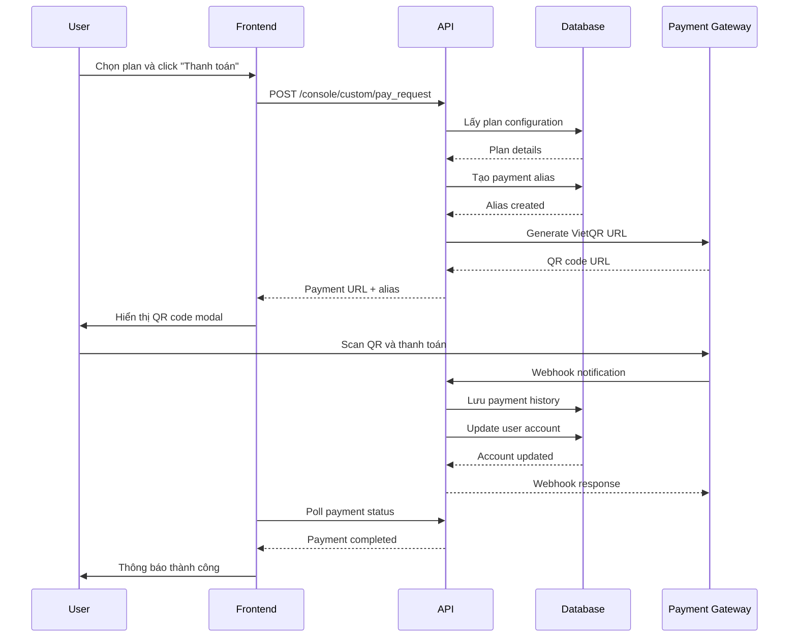
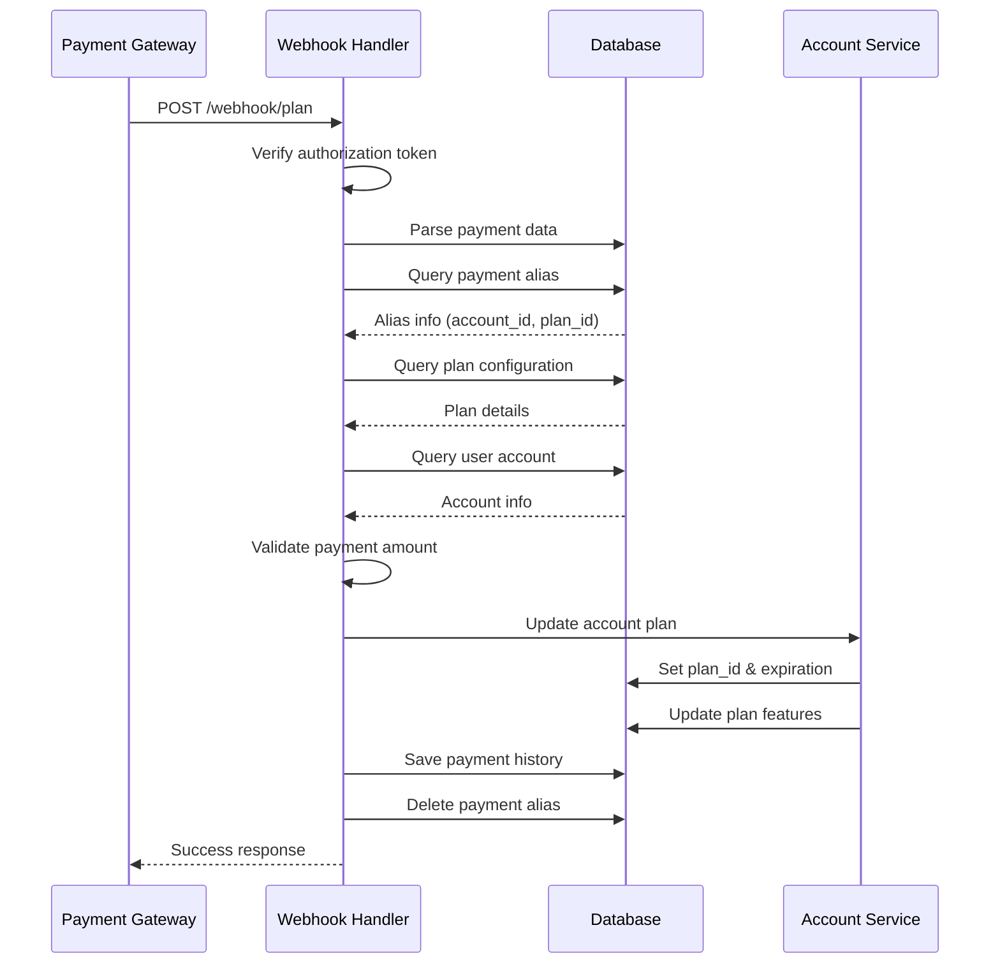
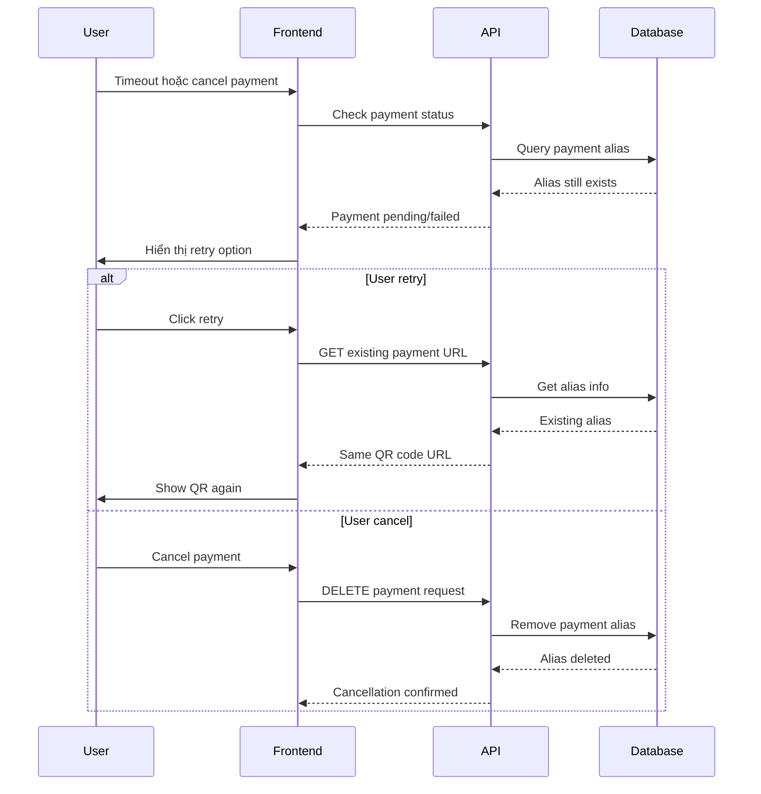

# Tài liệu Kỹ thuật Payment Module - Dify Dashboard

## 📋 Mục lục

1. [Tổng quan Payment Module](#1-tổng-quan-payment-module)
2. [Kiến trúc Payment Module](#2-kiến-trúc-payment-module)
3. [Database Schema](#3-database-schema)
4. [API Endpoints](#4-api-endpoints)
5. [Integration với Services khác](#5-integration-với-services-khác)
6. [Sequence Diagrams](#6-sequence-diagrams)
7. [Technical Implementation](#7-technical-implementation)
8. [Configuration và Environment](#8-configuration-và-environment)

---

## 1. Tổng quan Payment Module

### 1.1 Mô tả chung

Payment Module trong Dify Dashboard là hệ thống xử lý thanh toán tùy chỉnh được thiết kế để:

- Quản lý các gói dịch vụ (plans) và pricing
- Xử lý thanh toán qua VietQR gateway
- Theo dõi lịch sử giao dịch
- Tự động cập nhật quyền hạn user sau khi thanh toán thành công
- Cung cấp webhook để nhận thông báo từ payment gateway

### 1.2 Tính năng chính

- **Plan Management**: Quản lý các gói dịch vụ với features khác nhau
- **Payment Processing**: Tạo QR code thanh toán qua VietQR
- **Webhook Handler**: Xử lý thông báo thanh toán từ gateway
- **Payment History**: Lưu trữ và hiển thị lịch sử giao dịch
- **Auto Upgrade**: Tự động nâng cấp tài khoản sau thanh toán

---

## 2. Kiến trúc Payment Module

### 2.1 Cấu trúc thư mục

```
api/
├── controllers/
│   └── dashboard/
│       ├── plan.py                 # Payment controllers
│       └── models/
│           └── __init__.py         # Payment models
├── models/
│   ├── alies_payments_custom.py    # Payment alias model
│   ├── payments_history_custom.py  # Payment history model
│   └── system_custom_info.py       # System config model
└── services/
    └── billing_service.py          # Billing service

dashboard/
└── components/
    └── payments.py                 # Payment UI components

web/
└── app/
    └── components/
        └── billing/
            └── pricing/
                └── custom-plan.tsx # Frontend payment component
```

### 2.2 Các component chính

#### 2.2.1 Controllers

**`api/controllers/dashboard/plan.py`**
- `ApiPaymentSettings`: Quản lý cấu hình payment gateway
- `ApiPaymentHistory`: Lấy lịch sử giao dịch
- `ApiPlanWebhook`: Xử lý webhook từ payment gateway
- `ApiPayRequest`: Tạo yêu cầu thanh toán

#### 2.2.2 Models

**Payment Models:**
- `PaymentSettingsModel`: Cấu hình payment gateway
- `PaymentHistoryModel`: Thông tin giao dịch
- `AliesPaymentsInfo`: Thông tin payment alias
- `PayRequestModel`: Yêu cầu thanh toán

**Database Models:**
- `AliesPaymentsCustom`: Lưu trữ payment aliases
- `PaymentsHistoryCustom`: Lưu trữ lịch sử giao dịch
- `SystemCustomInfo`: Lưu trữ cấu hình hệ thống

#### 2.2.3 Services

**`api/services/billing_service.py`**
- Tích hợp với external billing services
- Xử lý payment links và invoices

---

## 3. Database Schema

### 3.1 Payment Tables

#### 3.1.1 system_custom_info
```sql
CREATE TABLE system_custom_info (
    id SERIAL PRIMARY KEY,
    name VARCHAR(255) UNIQUE NOT NULL,
    value JSONB,
    created_at TIMESTAMP DEFAULT CURRENT_TIMESTAMP,
    updated_at TIMESTAMP DEFAULT CURRENT_TIMESTAMP
);

-- Stores payment settings
INSERT INTO system_custom_info (name, value) VALUES 
('payment_settings', '{
    "access_token": "123456",
    "account_name": "Company Name",
    "account_id": "1234567890",
    "bank_id": "970422"
}');

-- Stores plan configurations
INSERT INTO system_custom_info (name, value) VALUES 
('plan', '[
    {
        "id": "basic",
        "name": "Basic Plan",
        "description": "Basic features",
        "price": 100000,
        "plan_expiration": 30,
        "features": {
            "members": 1,
            "apps": 10,
            "vector_space": 1000
        }
    }
]');
```

#### 3.1.2 payments_history_custom
```sql
CREATE TABLE payments_history_custom (
    id UUID PRIMARY KEY DEFAULT uuid_generate_v4(),
    value JSONB NOT NULL
);

-- Example payment history record
INSERT INTO payments_history_custom (value) VALUES ('{
    "id": "txn_123456",
    "id_account": "user_uuid",
    "id_plan": "basic",
    "type": "payment",
    "transactionID": "TXN123456789",
    "amount": 100000,
    "description": "plan12345678",
    "date": "2024-01-15T10:30:00Z",
    "bank": "Vietcombank"
}');
```

#### 3.1.3 alies_payments_custom
```sql
CREATE TABLE alies_payments_custom (
    id UUID PRIMARY KEY DEFAULT uuid_generate_v4(),
    id_account UUID NOT NULL,
    alies VARCHAR(255) UNIQUE NOT NULL,
    value JSONB,
    FOREIGN KEY (id_account) REFERENCES accounts(id) ON DELETE CASCADE
);

-- Example payment alias
INSERT INTO alies_payments_custom (id_account, alies, value) VALUES (
    'user_uuid',
    '12345678',
    '{"id_account": "user_uuid", "id_plan": "basic"}'
);
```

### 3.2 Account Extensions

Payment module mở rộng bảng `accounts` với các trường:

```sql
ALTER TABLE accounts ADD COLUMN IF NOT EXISTS id_custom_plan VARCHAR(255);
ALTER TABLE accounts ADD COLUMN IF NOT EXISTS plan_expiration TIMESTAMP;
ALTER TABLE accounts ADD COLUMN IF NOT EXISTS max_of_apps INTEGER DEFAULT 10;
ALTER TABLE accounts ADD COLUMN IF NOT EXISTS max_vector_space INTEGER DEFAULT 1000;
```

---

## 4. API Endpoints

### 4.1 Dashboard API Endpoints

**Base URL**: `/dashboard`
**Authentication**: API Key required (`api-token` header)

#### 4.1.1 Payment Settings

**GET /payment_settings**
```http
GET /dashboard/payment_settings
Headers:
  api-token: 89fisiqoo009

Response:
{
  "access_token": "123456",
  "account_name": "Company Name",
  "account_id": "1234567890",
  "bank_id": "970422"
}
```

**PUT /payment_settings**
```http
PUT /dashboard/payment_settings
Headers:
  api-token: 89fisiqoo009
  Content-Type: application/json

Body:
{
  "access_token": "new_token",
  "account_name": "Updated Company",
  "account_id": "0987654321",
  "bank_id": "970415"
}

Response:
{
  "status": "success",
  "message": "Payment settings updated successfully."
}
```

#### 4.1.2 Payment History

**GET /payment_history**
```http
GET /dashboard/payment_history
Headers:
  api-token: 89fisiqoo009

Response:
[
  {
    "id": "txn_123",
    "id_account": "user_uuid",
    "id_plan": "basic",
    "type": "payment",
    "transactionID": "TXN123456789",
    "amount": 100000,
    "description": "plan12345678",
    "date": "2024-01-15T10:30:00Z",
    "bank": "Vietcombank"
  }
]
```

#### 4.1.3 Plans Management

**GET /plans**
```http
GET /dashboard/plans
Headers:
  api-token: 89fisiqoo009

Response:
[
  {
    "id": "basic",
    "name": "Basic Plan",
    "description": "Basic features for small teams",
    "price": 100000,
    "plan_expiration": 30,
    "features": {
      "members": 1,
      "apps": 10,
      "vector_space": 1000,
      "knowledge_rate_limit": 100,
      "annotation_quota_limit": 1000,
      "documents_upload_quota": 50
    }
  }
]
```

### 4.2 Console API Endpoints

**Base URL**: `/console`

#### 4.2.1 Public Payment Settings

**GET /custom/payment_settings**
```http
GET /console/custom/payment_settings

Response:
{
  "account_name": "Company Name",
  "account_id": "1234567890",
  "bank_id": "970422"
}
```

#### 4.2.2 Payment Request

**POST /custom/pay_request**
```http
POST /console/custom/pay_request
Content-Type: application/json

Body:
{
  "id_account": "user_uuid",
  "id_plan": "basic"
}

Response:
{
  "status": "success",
  "message": "Payment request created successfully.",
  "url": "https://img.vietqr.io/image/970422-1234567890-print.png?amount=100000&addInfo=plan12345678&accountName=Company%20Name",
  "alies": "12345678"
}
```

### 4.3 Webhook Endpoint

**POST /webhook/plan**
```http
POST /dashboard/webhook/plan
Headers:
  Authorization: Bearer access_token
  Content-Type: application/json

Body:
{
  "data": [
    {
      "id": "txn_123",
      "id_account": "",
      "id_plan": "",
      "type": "payment",
      "transactionID": "TXN123456789",
      "amount": 100000,
      "description": "plan12345678",
      "date": "2024-01-15T10:30:00Z",
      "bank": "Vietcombank"
    }
  ]
}

Response:
{
  "status": true,
  "msg": "OK"
}
```

---

## 5. Integration với Services khác

### 5.1 User Management Integration

Payment module tích hợp chặt chẽ với user management system:

#### 5.1.1 Account Model Extensions
```python
# api/models/account.py
class Account(Base):
    # ... existing fields
    id_custom_plan = db.Column(db.String(255), nullable=True)
    plan_expiration = db.Column(db.DateTime, nullable=True)
    max_of_apps = db.Column(db.Integer, default=10)
    max_vector_space = db.Column(db.Integer, default=1000)
```

#### 5.1.2 Plan Assignment Flow
```python
# Sau khi thanh toán thành công
account = db.session.query(Account).filter_by(id=info.id_account).first()
if account and payment.amount >= plan.get('price', 0):
    # Assign plan và expiration
    account.id_custom_plan = info.id_plan
    account.plan_expiration = datetime.now(UTC) + timedelta(days=plan.get('plan_expiration', 0))

    # Update plan features
    features = plan.get('features', {})
    account.max_of_apps = features.get('apps', 10)
    account.max_vector_space = features.get('vector_space', 1000)

    db.session.add(account)
    db.session.commit()
```

### 5.2 Order Management Integration

#### 5.2.1 Payment Alias System
Payment module sử dụng hệ thống alias để tracking orders:

```python
# Tạo payment alias khi user request thanh toán
alies_payment_info = AliesPaymentsInfo(
    id_account=pay_request.id_account,
    id_plan=pay_request.id_plan
)

alies_payment = AliesPaymentsCustom(
    alies=generate_random_number(),  # 8-digit random number
    id_account=pay_request.id_account,
    value=alies_payment_info.model_dump(mode='json')
)
```

#### 5.2.2 Order Tracking
```python
# Decode alias từ payment description
def decode_description_pay(description):
    description = description.lower()
    match = re.search(r'\bplan(\d{8})\b', description or '')
    return match.group(1) if match else None

# Tìm order từ alias
alies_id = decode_description_pay(payment.description)
alies = db.session.query(AliesPaymentsCustom).filter_by(alies=alies_id).first()
```

### 5.3 Notification Service Integration

#### 5.3.1 Webhook Processing
```python
# Xử lý webhook từ payment gateway
@api.route('/webhook/plan', methods=['POST'])
def handle_payment_webhook():
    # Verify authorization
    auth = request.headers.get('Authorization', '')
    if not auth.startswith('Bearer '):
        return 'Access Token không được cung cấp hoặc không hợp lệ.', 401

    # Process payment data
    payload = request.get_json()
    for item in payload['data']:
        payment = PaymentHistoryModel.model_validate(item)
        # Record history và update account
```

#### 5.3.2 Real-time Updates
Frontend sử dụng polling để check payment status:

```typescript
// web/app/components/billing/pricing/custom-plan.tsx
const pollPaymentStatus = useCallback(async () => {
  if (!currentAlies) return

  try {
    const response = await fetch(`/console/custom/payment_status/${currentAlies}`)
    const data = await response.json()

    if (data.status === 'completed') {
      setIsQrModalOpen(false)
      Toast.notify({ type: 'success', message: 'Thanh toán thành công!' })
      // Refresh user data
      mutate()
    }
  } catch (error) {
    console.error('Error polling payment status:', error)
  }
}, [currentAlies])
```

---

## 6. Sequence Diagrams

### 6.1 Payment Creation Process



### 6.2 Payment Verification Flow



### 6.3 Payment Failure Handling



---

## 7. Technical Implementation

### 7.1 Payment Gateway Integration

#### 7.1.1 VietQR Integration

Payment module sử dụng VietQR để tạo QR code thanh toán:

```python
def generate_image_url_pay(bank_id, account_id, amount, description, account_name):
    """Generate VietQR payment URL"""
    parameters = {
        "amount": amount,
        "addInfo": description,
        "accountName": account_name
    }
    encoded_parameters = urllib.parse.urlencode(parameters)
    return f"https://img.vietqr.io/image/{bank_id}-{account_id}-print.png?{encoded_parameters}"
```

#### 7.1.2 Supported Banks

```python
SUPPORTED_BANKS = {
    "970415": "Vietinbank",
    "970422": "Military Bank",
    "970407": "Techcombank",
    "970416": "ACB",
    "970432": "VPBank",
    "970418": "BIDV",
    "970405": "Agribank",
    "970448": "OCB",
    "970414": "Oceanbank",
    "970431": "Eximbank"
}
```

### 7.2 Error Handling và Retry Mechanisms

#### 7.2.1 Webhook Error Handling

```python
class ApiPlanWebhook(Resource):
    def post(self):
        try:
            # Verify authorization
            auth = request.headers.get('Authorization', '')
            if not auth.startswith('Bearer '):
                return 'Access Token không được cung cấp hoặc không hợp lệ.', 401

            # Process payments with error handling
            payload = request.get_json()
            for item in payload['data']:
                try:
                    payment = PaymentHistoryModel.model_validate(item)
                    # Process payment...
                except Exception as e:
                    print(f"Error validating payment data: {e}")
                    continue  # Skip invalid payments

        except Exception as e:
            print(f"Webhook processing error: {e}")
            return {'status': False, 'msg': 'Internal error'}, 500
```

#### 7.2.2 Database Transaction Safety

```python
def process_payment_safely(payment_data):
    """Process payment with database transaction safety"""
    try:
        # Start transaction
        db.session.begin()

        # Record payment history
        hist = PaymentsHistoryCustom(value=payment_data)
        db.session.add(hist)

        # Update account
        account.id_custom_plan = plan_id
        account.plan_expiration = new_expiration
        db.session.add(account)

        # Remove alias
        db.session.delete(alies)

        # Commit all changes
        db.session.commit()

    except Exception as e:
        # Rollback on error
        db.session.rollback()
        raise e
```

### 7.3 Security Measures

#### 7.3.1 Webhook Authentication

```python
def verify_webhook_token(request):
    """Verify webhook authorization token"""
    auth = request.headers.get('Authorization', '')
    if not auth.startswith('Bearer '):
        return False

    token = auth[7:]

    # Fetch stored token from database
    sys_info = db.session.query(SystemCustomInfo).filter_by(name='payment_settings').first()
    if not sys_info:
        return False

    settings = PaymentSettingsModel.model_validate(sys_info.value)
    return token == settings.access_token
```

#### 7.3.2 Input Validation

```python
class PaymentHistoryModel(BaseModel):
    """Payment history with validation"""
    id_account: str = Field(..., min_length=1)
    id_plan: str = Field(..., min_length=1)
    id: str = Field(..., min_length=1)
    type: str = Field(..., regex=r'^(payment|refund)$')
    transactionID: str = Field(..., min_length=1)
    amount: float = Field(..., gt=0)
    description: str = Field(..., min_length=1)
    date: str = Field(..., regex=r'^\d{4}-\d{2}-\d{2}T\d{2}:\d{2}:\d{2}')
    bank: str = Field(..., min_length=1)
```

#### 7.3.3 Rate Limiting

```python
from flask_limiter import Limiter
from flask_limiter.util import get_remote_address

limiter = Limiter(
    app,
    key_func=get_remote_address,
    default_limits=["200 per day", "50 per hour"]
)

@api.route('/webhook/plan', methods=['POST'])
@limiter.limit("10 per minute")
def webhook_handler():
    # Webhook processing...
```

### 7.4 Logging và Monitoring

#### 7.4.1 Payment Logging

```python
import logging

# Configure payment logger
payment_logger = logging.getLogger('payment')
payment_logger.setLevel(logging.INFO)

handler = logging.FileHandler('/app/logs/payment.log')
formatter = logging.Formatter('%(asctime)s - %(name)s - %(levelname)s - %(message)s')
handler.setFormatter(formatter)
payment_logger.addHandler(handler)

def log_payment_event(event_type, data):
    """Log payment events for monitoring"""
    payment_logger.info(f"Payment {event_type}: {json.dumps(data)}")

# Usage
log_payment_event('request_created', {
    'account_id': account_id,
    'plan_id': plan_id,
    'amount': amount,
    'alias': alias
})
```

#### 7.4.2 Metrics Collection

```python
from prometheus_client import Counter, Histogram

# Payment metrics
payment_requests = Counter('payment_requests_total', 'Total payment requests')
payment_success = Counter('payment_success_total', 'Successful payments')
payment_failures = Counter('payment_failures_total', 'Failed payments')
payment_duration = Histogram('payment_processing_seconds', 'Payment processing time')

@payment_duration.time()
def process_payment(payment_data):
    payment_requests.inc()
    try:
        # Process payment...
        payment_success.inc()
    except Exception as e:
        payment_failures.inc()
        raise e
```

---

## 8. Configuration và Environment

### 8.1 Environment Variables

#### 8.1.1 Payment Gateway Configuration

```bash
# .env file
# Payment Gateway Settings
PAYMENT_GATEWAY_URL=https://img.vietqr.io
PAYMENT_WEBHOOK_SECRET=your_webhook_secret_key
PAYMENT_DEFAULT_BANK_ID=970422
PAYMENT_DEFAULT_ACCOUNT_ID=1234567890
PAYMENT_DEFAULT_ACCOUNT_NAME="Company Name"

# API Authentication
DASHBOARD_API_KEY=89fisiqoo009

# Database Configuration
DB_HOST=db
DB_PORT=5432
DB_USERNAME=postgres
DB_PASSWORD=difyai123456
DB_DATABASE=dify

# Redis Configuration (for caching)
REDIS_HOST=redis
REDIS_PORT=6379
REDIS_PASSWORD=difyai123456
```

#### 8.1.2 Docker Environment

```yaml
# docker-compose.yaml
services:
  api:
    environment:
      # Payment specific variables
      PAYMENT_GATEWAY_URL: ${PAYMENT_GATEWAY_URL:-https://img.vietqr.io}
      PAYMENT_WEBHOOK_SECRET: ${PAYMENT_WEBHOOK_SECRET:-}
      DASHBOARD_API_KEY: ${DASHBOARD_API_KEY:-89fisiqoo009}

  dashboard:
    environment:
      API_URL: "http://api:5001"
      PAYMENT_WEBHOOK_URL: "http://api:5001/dashboard/webhook/plan"
```

### 8.2 Database Migrations

#### 8.2.1 Payment Tables Migration

```python
# migrations/versions/payment_tables.py
"""Add payment tables

Revision ID: payment_001
Revises: base_migration
Create Date: 2024-01-15 10:00:00.000000

"""
from alembic import op
import sqlalchemy as sa
from sqlalchemy.dialects import postgresql

# revision identifiers
revision = 'payment_001'
down_revision = 'base_migration'
branch_labels = None
depends_on = None

def upgrade():
    # Create system_custom_info table
    op.create_table('system_custom_info',
        sa.Column('id', sa.Integer(), nullable=False),
        sa.Column('name', sa.String(255), nullable=False),
        sa.Column('value', postgresql.JSONB(), nullable=True),
        sa.Column('created_at', sa.DateTime(), server_default=sa.text('CURRENT_TIMESTAMP')),
        sa.Column('updated_at', sa.DateTime(), server_default=sa.text('CURRENT_TIMESTAMP')),
        sa.PrimaryKeyConstraint('id'),
        sa.UniqueConstraint('name')
    )

    # Create payments_history_custom table
    op.create_table('payments_history_custom',
        sa.Column('id', sa.String(), server_default=sa.text('uuid_generate_v4()'), nullable=False),
        sa.Column('value', postgresql.JSONB(), nullable=False),
        sa.PrimaryKeyConstraint('id')
    )

    # Create alies_payments_custom table
    op.create_table('alies_payments_custom',
        sa.Column('id', sa.String(), server_default=sa.text('uuid_generate_v4()'), nullable=False),
        sa.Column('id_account', sa.String(), nullable=False),
        sa.Column('alies', sa.String(255), nullable=False),
        sa.Column('value', postgresql.JSONB(), nullable=True),
        sa.ForeignKeyConstraint(['id_account'], ['accounts.id'], ondelete='CASCADE'),
        sa.PrimaryKeyConstraint('id'),
        sa.UniqueConstraint('alies')
    )

    # Add payment columns to accounts table
    op.add_column('accounts', sa.Column('id_custom_plan', sa.String(255), nullable=True))
    op.add_column('accounts', sa.Column('plan_expiration', sa.DateTime(), nullable=True))
    op.add_column('accounts', sa.Column('max_of_apps', sa.Integer(), default=10))
    op.add_column('accounts', sa.Column('max_vector_space', sa.Integer(), default=1000))

def downgrade():
    # Remove payment columns from accounts
    op.drop_column('accounts', 'max_vector_space')
    op.drop_column('accounts', 'max_of_apps')
    op.drop_column('accounts', 'plan_expiration')
    op.drop_column('accounts', 'id_custom_plan')

    # Drop payment tables
    op.drop_table('alies_payments_custom')
    op.drop_table('payments_history_custom')
    op.drop_table('system_custom_info')
```

#### 8.2.2 Initial Data Migration

```python
# migrations/versions/payment_initial_data.py
"""Insert initial payment data

Revision ID: payment_002
Revises: payment_001
Create Date: 2024-01-15 11:00:00.000000

"""
from alembic import op
import sqlalchemy as sa
import json

def upgrade():
    # Insert default payment settings
    payment_settings = {
        "access_token": "123456",
        "account_name": "",
        "account_id": "",
        "bank_id": "970422"
    }

    # Insert default plans
    default_plans = [
        {
            "id": "basic",
            "name": "Basic Plan",
            "description": "Perfect for individuals and small teams",
            "price": 100000,
            "plan_expiration": 30,
            "features": {
                "members": 1,
                "apps": 10,
                "vector_space": 1000,
                "knowledge_rate_limit": 100,
                "annotation_quota_limit": 1000,
                "documents_upload_quota": 50
            }
        },
        {
            "id": "pro",
            "name": "Professional Plan",
            "description": "For growing businesses",
            "price": 300000,
            "plan_expiration": 30,
            "features": {
                "members": 5,
                "apps": 50,
                "vector_space": 5000,
                "knowledge_rate_limit": 500,
                "annotation_quota_limit": 5000,
                "documents_upload_quota": 200
            }
        }
    ]

    # Insert data
    connection = op.get_bind()
    connection.execute(
        sa.text("INSERT INTO system_custom_info (name, value) VALUES (:name, :value)"),
        {"name": "payment_settings", "value": json.dumps(payment_settings)}
    )
    connection.execute(
        sa.text("INSERT INTO system_custom_info (name, value) VALUES (:name, :value)"),
        {"name": "plan", "value": json.dumps(default_plans)}
    )

def downgrade():
    connection = op.get_bind()
    connection.execute(
        sa.text("DELETE FROM system_custom_info WHERE name IN ('payment_settings', 'plan')")
    )
```

### 8.3 Docker Configuration

#### 8.3.1 Payment Service Configuration

```dockerfile
# api/Dockerfile - Payment service extensions
FROM python:3.11-slim

# Install payment dependencies
COPY requirements.txt /app/
RUN pip install -r requirements.txt

# Add payment modules
COPY controllers/dashboard/ /app/controllers/dashboard/
COPY models/ /app/models/
COPY services/ /app/services/

# Set environment variables
ENV PAYMENT_GATEWAY_URL=https://img.vietqr.io
ENV DASHBOARD_API_KEY=89fisiqoo009

EXPOSE 5001
CMD ["python", "app.py"]
```

#### 8.3.2 Dashboard Service Configuration

```dockerfile
# dashboard/Dockerfile
FROM python:3.11-slim

WORKDIR /app

# Install dashboard dependencies
COPY requirements.txt .
RUN pip install -r requirements.txt

# Copy dashboard application
COPY . .

# Expose Streamlit port
EXPOSE 8501

# Set environment variables
ENV API_URL=http://api:5001
ENV PAYMENT_WEBHOOK_URL=http://api:5001/dashboard/webhook/plan

# Run Streamlit
CMD ["streamlit", "run", "main.py", "--server.port=8501", "--server.address=0.0.0.0"]
```

### 8.4 Monitoring và Health Checks

#### 8.4.1 Health Check Endpoints

```python
# api/controllers/dashboard/health.py
from flask import jsonify
from flask_restful import Resource

class PaymentHealthCheck(Resource):
    def get(self):
        """Payment module health check"""
        try:
            # Check database connection
            db.session.execute(sa.text("SELECT 1"))

            # Check payment settings
            settings = db.session.query(SystemCustomInfo).filter_by(name='payment_settings').first()

            # Check plans configuration
            plans = db.session.query(SystemCustomInfo).filter_by(name='plan').first()

            return jsonify({
                "status": "healthy",
                "database": "connected",
                "payment_settings": "configured" if settings else "missing",
                "plans": "configured" if plans else "missing",
                "timestamp": datetime.utcnow().isoformat()
            })

        except Exception as e:
            return jsonify({
                "status": "unhealthy",
                "error": str(e),
                "timestamp": datetime.utcnow().isoformat()
            }), 500

# Add to routes
api.add_resource(PaymentHealthCheck, "/health/payment")
```

#### 8.4.2 Docker Health Checks

```yaml
# docker-compose.yaml
services:
  api:
    healthcheck:
      test: ["CMD", "curl", "-f", "http://localhost:5001/dashboard/health/payment"]
      interval: 30s
      timeout: 10s
      retries: 3
      start_period: 40s

  dashboard:
    healthcheck:
      test: ["CMD", "curl", "-f", "http://localhost:8501/_stcore/health"]
      interval: 30s
      timeout: 10s
      retries: 3
      start_period: 40s
```

### 8.5 Backup và Recovery

#### 8.5.1 Payment Data Backup

```bash
#!/bin/bash
# scripts/backup_payment_data.sh

# Backup payment tables
pg_dump -h $DB_HOST -U $DB_USERNAME -d $DB_DATABASE \
  --table=system_custom_info \
  --table=payments_history_custom \
  --table=alies_payments_custom \
  --data-only \
  --file=payment_backup_$(date +%Y%m%d_%H%M%S).sql

# Backup payment settings
psql -h $DB_HOST -U $DB_USERNAME -d $DB_DATABASE \
  -c "COPY (SELECT * FROM system_custom_info WHERE name IN ('payment_settings', 'plan')) TO STDOUT WITH CSV HEADER" \
  > payment_config_$(date +%Y%m%d_%H%M%S).csv
```

#### 8.5.2 Recovery Procedures

```bash
#!/bin/bash
# scripts/restore_payment_data.sh

BACKUP_FILE=$1

if [ -z "$BACKUP_FILE" ]; then
    echo "Usage: $0 <backup_file.sql>"
    exit 1
fi

# Restore payment data
psql -h $DB_HOST -U $DB_USERNAME -d $DB_DATABASE -f $BACKUP_FILE

echo "Payment data restored from $BACKUP_FILE"
```

---

## 9. Troubleshooting Guide

### 9.1 Common Issues

#### 9.1.1 Webhook Not Receiving

**Triệu chứng**: Payment thành công nhưng account không được update

**Nguyên nhân**:
- Webhook URL không accessible
- Authorization token không đúng
- Firewall blocking

**Giải pháp**:
```bash
# Check webhook endpoint
curl -X POST http://your-domain/dashboard/webhook/plan \
  -H "Authorization: Bearer your_token" \
  -H "Content-Type: application/json" \
  -d '{"data": []}'

# Check logs
docker logs dify-api | grep webhook
```

#### 9.1.2 QR Code Not Generating

**Triệu chứng**: Payment request fails với QR generation error

**Nguyên nhân**:
- VietQR service down
- Invalid bank configuration
- Network connectivity issues

**Giải pháp**:
```python
# Test VietQR connectivity
import requests
url = "https://img.vietqr.io/image/970422-1234567890-print.png?amount=100000"
response = requests.get(url)
print(f"Status: {response.status_code}")
```

#### 9.1.3 Database Connection Issues

**Triệu chứng**: Payment operations fail với database errors

**Giải pháp**:
```bash
# Check database connection
docker exec -it dify-db psql -U postgres -d dify -c "SELECT COUNT(*) FROM system_custom_info;"

# Check payment tables
docker exec -it dify-db psql -U postgres -d dify -c "\dt *payment*"
```

### 9.2 Performance Optimization

#### 9.2.1 Database Indexing

```sql
-- Add indexes for better performance
CREATE INDEX idx_payments_history_account ON payments_history_custom USING GIN (value);
CREATE INDEX idx_alies_payments_account ON alies_payments_custom (id_account);
CREATE INDEX idx_alies_payments_alies ON alies_payments_custom (alies);
CREATE INDEX idx_accounts_plan ON accounts (id_custom_plan);
CREATE INDEX idx_accounts_expiration ON accounts (plan_expiration);
```

#### 9.2.2 Caching Strategy

```python
# Redis caching for payment settings
import redis
import json

redis_client = redis.Redis(host='redis', port=6379, password='difyai123456')

def get_payment_settings_cached():
    """Get payment settings with Redis caching"""
    cache_key = "payment_settings"
    cached = redis_client.get(cache_key)

    if cached:
        return json.loads(cached)

    # Fetch from database
    settings = db.session.query(SystemCustomInfo).filter_by(name='payment_settings').first()
    if settings:
        redis_client.setex(cache_key, 3600, json.dumps(settings.value))  # Cache for 1 hour
        return settings.value

    return None
```

---

## 10. API Testing Guide

### 10.1 Postman Collection

```json
{
  "info": {
    "name": "Dify Payment API",
    "description": "Payment module API testing collection"
  },
  "item": [
    {
      "name": "Get Payment Settings",
      "request": {
        "method": "GET",
        "header": [
          {
            "key": "api-token",
            "value": "89fisiqoo009"
          }
        ],
        "url": {
          "raw": "{{base_url}}/dashboard/payment_settings",
          "host": ["{{base_url}}"],
          "path": ["dashboard", "payment_settings"]
        }
      }
    },
    {
      "name": "Create Payment Request",
      "request": {
        "method": "POST",
        "header": [
          {
            "key": "Content-Type",
            "value": "application/json"
          }
        ],
        "body": {
          "mode": "raw",
          "raw": "{\n  \"id_account\": \"user_uuid\",\n  \"id_plan\": \"basic\"\n}"
        },
        "url": {
          "raw": "{{base_url}}/console/custom/pay_request",
          "host": ["{{base_url}}"],
          "path": ["console", "custom", "pay_request"]
        }
      }
    },
    {
      "name": "Webhook Test",
      "request": {
        "method": "POST",
        "header": [
          {
            "key": "Authorization",
            "value": "Bearer 123456"
          },
          {
            "key": "Content-Type",
            "value": "application/json"
          }
        ],
        "body": {
          "mode": "raw",
          "raw": "{\n  \"data\": [\n    {\n      \"id\": \"txn_123\",\n      \"id_account\": \"\",\n      \"id_plan\": \"\",\n      \"type\": \"payment\",\n      \"transactionID\": \"TXN123456789\",\n      \"amount\": 100000,\n      \"description\": \"plan12345678\",\n      \"date\": \"2024-01-15T10:30:00Z\",\n      \"bank\": \"Vietcombank\"\n    }\n  ]\n}"
        },
        "url": {
          "raw": "{{base_url}}/dashboard/webhook/plan",
          "host": ["{{base_url}}"],
          "path": ["dashboard", "webhook", "plan"]
        }
      }
    }
  ],
  "variable": [
    {
      "key": "base_url",
      "value": "http://localhost:5001"
    }
  ]
}
```

### 10.2 Unit Tests

```python
# tests/test_payment.py
import unittest
from unittest.mock import patch, MagicMock
from api.controllers.dashboard.plan import ApiPayRequest, generate_random_number, decode_description_pay

class TestPaymentModule(unittest.TestCase):

    def test_generate_random_number(self):
        """Test random number generation"""
        number = generate_random_number()
        self.assertEqual(len(number), 8)
        self.assertTrue(number.isdigit())

    def test_decode_description_pay(self):
        """Test payment description decoding"""
        # Valid description
        result = decode_description_pay("plan12345678")
        self.assertEqual(result, "12345678")

        # Invalid description
        result = decode_description_pay("invalid description")
        self.assertIsNone(result)

    @patch('api.controllers.dashboard.plan.db.session')
    def test_payment_request_creation(self, mock_db):
        """Test payment request creation"""
        # Mock database responses
        mock_db.query.return_value.filter_by.return_value.first.return_value = None

        # Test payment request
        api = ApiPayRequest()
        # Add test implementation...

if __name__ == '__main__':
    unittest.main()
```

---

## 11. Kết luận

Payment Module trong Dify Dashboard cung cấp một hệ thống thanh toán hoàn chỉnh với:

- **Tích hợp VietQR**: Dễ dàng thanh toán qua QR code
- **Webhook Processing**: Xử lý thông báo thanh toán real-time
- **Security**: Authentication và validation đầy đủ
- **Monitoring**: Logging và health checks
- **Scalability**: Thiết kế microservice có thể mở rộng

Module này có thể được mở rộng để hỗ trợ thêm các payment gateway khác như Stripe, PayPal, hoặc các ngân hàng Việt Nam khác.

Để triển khai thành công, cần đảm bảo:
1. Cấu hình đúng environment variables
2. Database migrations được chạy
3. Webhook URL accessible từ payment gateway
4. Monitoring và logging được thiết lập
5. Backup và recovery procedures được test

---

**Tài liệu này được tạo vào**: 2024-01-15
**Phiên bản**: 1.0
**Tác giả**: Dify Development Team
